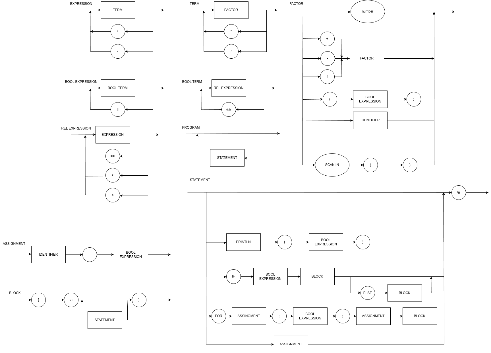

# Compilador
Compilador Lógica da Computação


Run using the command ```./run.sh```


# Versions

[V1.0](https://github.com/pedroaltobelli23/Compilador/tree/v1.0.6)

```
EXPRESSION = NUMBER, {("+" | "-"), NUMBER};
NUMBER = DIGIT, {DIGIT};
DIGIT = ( 1 | 2 | 3 | 4 | 5 | 6 | 7 | 8 | 9 | 0 );
```


[V1.1](https://github.com/pedroaltobelli23/Compilador/tree/v1.1.0)

```
EXPRESSION = TERM, {("+" | "-"), TERM};
TERM = NUMBER, {("*" | "/"), NUMBER};
NUMBER = DIGIT, {DIGIT};
DIGIT = ( 1 | 2 | 3 | 4 | 5 | 6 | 7 | 8 | 9 | 0 );
```


[V1.2](https://github.com/pedroaltobelli23/Compilador/tree/v1.2.1)

```
EXPRESSION = TERM, { ("+" | "-"), TERM } ;
TERM = FACTOR, { ("*" | "/"), FACTOR } ;
FACTOR = ("+" | "-") FACTOR | "(" EXPRESSION ")" | NUMBER ;
NUMBER = DIGIT, {DIGIT};
DIGIT = ( 1 | 2 | 3 | 4 | 5 | 6 | 7 | 8 | 9 | 0 );
```


[V2.0](https://github.com/pedroaltobelli23/Compilador/tree/v2.0.5)

```
EXPRESSION = TERM, { ("+" | "-"), TERM } ;
TERM = FACTOR, { ("*" | "/"), FACTOR } ;
FACTOR = (("+" | "-"), FACTOR) | "(" EXPRESSION ")" | NUMBER ;
NUMBER = DIGIT, {DIGIT};
DIGIT = ( 1 | 2 | 3 | 4 | 5 | 6 | 7 | 8 | 9 | 0 );
```


[V2.1](https://github.com/pedroaltobelli23/Compilador/tree/v2.1.1)

```
BLOCK = { STATEMENT };
STATEMENT = ( λ | ASSIGNMENT | PRINT), "\n" ;
ASSIGNMENT = IDENTIFIER, "=", EXPRESSION ;
PRINT = "Println", "(", EXPRESSION, ")" ;
EXPRESSION = TERM, { ("+" | "-"), TERM } ;
TERM = FACTOR, { ("*" | "/"), FACTOR } ;
FACTOR = (("+" | "-"), FACTOR) | NUMBER | "(", EXPRESSION, ")" | IDENTIFIER ;
IDENTIFIER = LETTER, { LETTER | DIGIT | "_" } ;
NUMBER = DIGIT, { DIGIT } ;
LETTER = ( a | ... | z | A | ... | Z ) ;
DIGIT = ( 1 | 2 | 3 | 4 | 5 | 6 | 7 | 8 | 9 | 0 ) ;
```


[V2.2](https://github.com/pedroaltobelli23/Compilador/tree/v2.2.0)

```
PROGRAM = { STATEMENT };
BLOCK = "{", "\n", { STATEMENT }, "}";
ASSIGNMENT = IDENTIFIER, "=", BOOLEXPRESSION ;
STATEMENT = ( λ | ASSIGNMENT | PRINT | IF | FOR ), "\n" ;
IF = "if", BOOLEXPRESSION, BLOCK, (λ | ("else", BLOCK ));
FOR = "for", ASSIGNMENT, ";", BOOLEXPRESSION, ";", ASSIGNMENT, BLOCK;
BOOLEXPRESSION = BOOLTERM, { "||" , BOOLTERM };
BOOLTERM = RELEXPRESSION, {"&&", RELEXPRESSION };
RELEXPRESSION = EXPRESSION, { ("==" | ">" | "<") , EXPRESSION };
EXPRESSION = TERM, { ("+" | "-"), TERM } ;
TERM = FACTOR, { ("*" | "/"), FACTOR } ;
FACTOR = (("+" | "-" | "!"), FACTOR) | NUMBER | "(", BOOLEXPRESSION, ")" | IDENTIFIER | SCAN;
IDENTIFIER = LETTER, { LETTER | DIGIT | "_" } ;
NUMBER = DIGIT, { DIGIT } ;
LETTER = ( a | ... | z | A | ... | Z ) ;
DIGIT = ( 1 | 2 | 3 | 4 | 5 | 6 | 7 | 8 | 9 | 0 ) ;
PRINT = "Println", "(", EXPRESSION, ")" ;
SCAN = "Scanln", "(",")";
```



[V2.3](https://github.com/pedroaltobelli23/Compilador/tree/v2.3.5) e [V3.0](https://github.com/pedroaltobelli23/Compilador/tree/v3.0.0)

```
PROGRAM = { STATEMENT };
BLOCK = "{", "\n", { STATEMENT }, "}";
ASSIGNMENT = IDENTIFIER, "=", BOOLEXPRESSION ;
STATEMENT = ( λ | ASSIGNMENT | PRINT | IF | FOR | VARDECLARATION), "\n" ;
VARDECLARATION = "var", IDENTIFIER, TYPE, (λ | "=",BOOLEXPRESSION);
IF = "if", BOOLEXPRESSION, BLOCK, (λ | ("else", BLOCK ));
FOR = "for", ASSIGNMENT, ";", BOOLEXPRESSION, ";", ASSIGNMENT, BLOCK;
BOOLEXPRESSION = BOOLTERM, { "||" , BOOLTERM };
BOOLTERM = RELEXPRESSION, {"&&", RELEXPRESSION };
RELEXPRESSION = EXPRESSION, { ("==" | ">" | "<") , EXPRESSION };
EXPRESSION = TERM, { ("+" | "-"), TERM } ;
TERM = FACTOR, { ("*" | "/"), FACTOR } ;
FACTOR = (("+" | "-" | "!"), FACTOR) | NUMBER | STRING | "(", BOOLEXPRESSION, ")" | IDENTIFIER | SCAN;
TYPE = ("int" | "string");
IDENTIFIER = LETTER, { LETTER | DIGIT | "_" } ;
NUMBER = DIGIT, { DIGIT } ;
STRING = LETTER , { LETTER | DIGIT | "_" | " " };
LETTER = ( a | ... | z | A | ... | Z ) ;
DIGIT = ( 1 | 2 | 3 | 4 | 5 | 6 | 7 | 8 | 9 | 0 ) ;
PRINT = "Println", "(", EXPRESSION, ")" ;
SCAN = "Scanln", "(",")";
```


[V2.4](https://github.com/pedroaltobelli23/Compilador/tree/v2.4.1)

```
PROGRAM = { STATEMENT };
BLOCK = "{", "\n", { STATEMENT }, "}";
ASSIGNMENT = IDENTIFIER, (("=", BOOLEXPRESSION) | ("(",(λ | (BOOLEXPRESSION, { "," , BOOLEXPRESSION })),")")) ;
STATEMENT = ( λ | ASSIGNMENT | PRINT | IF | FOR | VARDECLARATION | ("Return",BOOLEXPRESSION)), "\n" ;
VARDECLARATION = "var", IDENTIFIER, TYPE, (λ | "=",BOOLEXPRESSION);
IF = "if", BOOLEXPRESSION, BLOCK, (λ|("else", BLOCK ));
FOR = "for", ASSIGNMENT, ";", BOOLEXPRESSION, ";", ASSIGNMENT, BLOCK;
BOOLEXPRESSION = BOOLTERM, { "||" , BOOLTERM };
BOOLTERM = RELEXPRESSION, {"&&", RELEXPRESSION };
RELEXPRESSION = EXPRESSION, { ("==" | ">" | "<") , EXPRESSION };
EXPRESSION = TERM, { ("+" | "-" | "."), TERM } ;
TERM = FACTOR, { ("*" | "/"), FACTOR } ;
FACTOR = (("+" | "-" | "!"), FACTOR) | NUMBER | STRING | "(", BOOLEXPRESSION, ")" | (IDENTIFIER,(λ | ("(",(λ | (BOOLEXPRESSION, { "," , BOOLEXPRESSION })),")")))| SCAN;
TYPE = ("int" | "string");
IDENTIFIER = LETTER, { LETTER | DIGIT | "_" } ;
NUMBER = DIGIT, { DIGIT } ;
STRING = LETTER , { LETTER | DIGIT | "_" | " " };
LETTER = ( a | ... | z | A | ... | Z ) ;
DIGIT = ( 1 | 2 | 3 | 4 | 5 | 6 | 7 | 8 | 9 | 0 ) ;
PRINT = "Println", "(", EXPRESSION, ")" ;
SCAN = "Scanln", "(",")";
DECLARATION = "func", IDENTIFIER, "(",(λ | (IDENTIFIER, TYPE, { "," , IDENTIFIER, TYPE })),")",TYPE,BLOCK,"\n";
```

